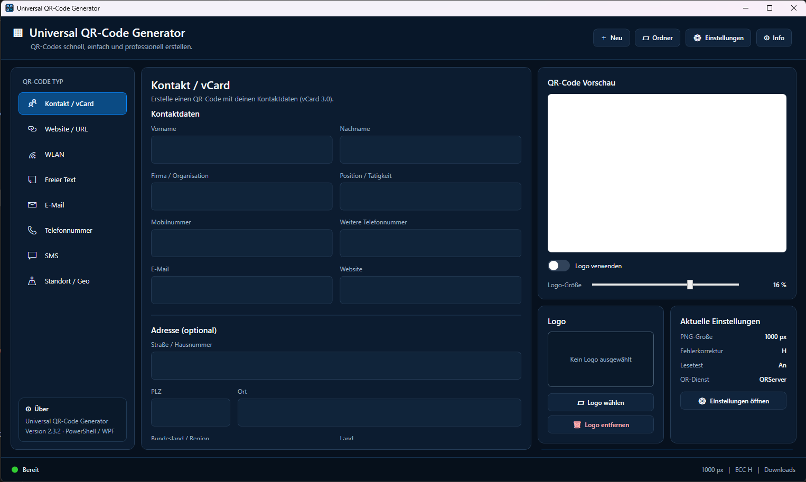
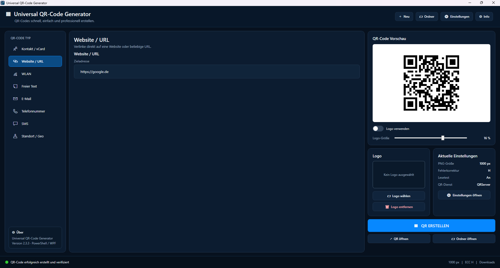
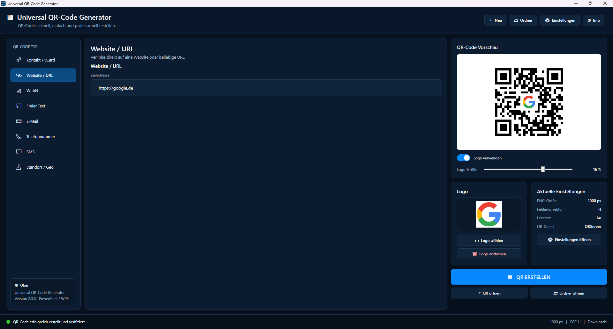

[English](README.md) | [**Deutsch**](README.de.md)

# Universal QR-Code Generator — WPF v2.5

Eine leichte und portable Windows-Desktop-Anwendung zum Erstellen von QR-Codes mit **PowerShell 5.1 + WPF/XAML**.

Die Anwendung unterstützt vollständig lokale / offline QR-Erzeugung, optionale Online-Provider, automatischen Fallback, eine deutsche und englische Oberfläche, eigene Logos, vCard-Export und QR-Lesbarkeitstests.

<p align="center">
  <a href="screenshots/Screenshot1.png">
    
  </a>
  &nbsp;
  <a href="screenshots/Screenshot2.png">
    
  </a>
  &nbsp;
  <a href="screenshots/Screenshot3.png">
    
  </a>
</p>

<p align="center">
  <i>Zum Vergrößern auf einen Screenshot klicken.</i>
</p>

<p align="center">
  <strong>🌐 Jetzt direkt im Browser ausprobieren</strong><br><br>
  <a href="https://drfailbucket.github.io/QR_Code-Generator-with-UI/">
    <strong>Web QR Generator öffnen →</strong>
  </a>
</p>

Die v2-Oberfläche ist ein vollständiger WPF-Neuaufbau der ursprünglichen WinForms-Version. Die QR-Logik ist von der Oberfläche getrennt, sodass Design und Funktionen erweitert werden können, ohne das komplette Frontend neu schreiben zu müssen.

## Web-Version

Über GitHub Pages steht zusätzlich eine Browser-Version bereit:

**[Web QR Generator öffnen →](https://drfailbucket.github.io/QR_Code-Generator-with-UI/)**

Die Web-Version bietet die gleichen grundlegenden QR-Typen und eine sehr ähnliche Oberfläche wie die Windows-Anwendung.

Unterstützt werden:

- Kontakt / vCard
- Website / URL
- WLAN
- Freier Text
- E-Mail
- Telefon
- SMS
- Geo-Koordinaten
- eigenes Logo
- PNG-Download
- vCard-Download
- deutsche und englische Oberfläche
- automatischer oder manueller Online-Lesetest
- Unicode-/Zeichensatz-Warnungen

Die Web-Version nutzt bewusst ausschließlich die feste **QRServer / goQR.me API**. Es gibt dort keine benutzerdefinierte API-Konfiguration und keinen im Quellcode hinterlegten API-Schlüssel.

Beim Erzeugen eines QR-Codes wird dessen Inhalt an QRServer übertragen. Wird der Online-Lesetest verwendet, wird zusätzlich das fertige QR-Bild an den QRServer-Lesedienst hochgeladen.

Für sensible Daten, Offline-Nutzung oder die höchste Zuverlässigkeit bei Unicode-Zeichen empfiehlt sich die **Windows-Desktop-Version**. Deren lokale QR-Engine kann QR-Codes vollständig auf dem Gerät erzeugen und verwendet einen Online-Dienst nur bei entsprechender Einstellung oder als optionalen Fallback.

**[Neueste Desktop-Version herunterladen →](https://github.com/DrFailbucket/QR_Code-Generator-with-UI/releases/latest)**

## Funktionen

### QR-Typen

- Kontakt / vCard 3.0
- Website / URL
- WLAN-Zugangsdaten
- Freier Text
- E-Mail
- Telefonnummer
- SMS
- Geo-Koordinaten

### Allgemein

- moderne dunkle WPF-Oberfläche
- deutsche und englische UI
- automatische Erkennung der Windows-Sprache
- Sprachwechsel ohne Neustart
- QR-Vorschau
- PNG-Export
- automatischer `.vcf`-Export für vCards
- konfigurierbare QR-Größe
- konfigurierbare ECC-Stufe
- optionales eigenes Logo in der Mitte
- einstellbare Logo-Größe von 8–20 %
- automatisches ECC `H`, sobald ein Logo verwendet wird
- portable Konfiguration
- keine Installation erforderlich
- keine externen PowerShell-Module erforderlich

### QR-Erzeugungsprovider

- **Lokale / Offline QR-Engine**
- **QRServer / goQR.me**
- **benutzerdefinierte QRServer-kompatible API**
- optionaler Online-Fallback, falls die lokale Erzeugung fehlschlägt
- optionaler automatischer Online-Lesetest
- manueller Button **QR-Code online prüfen**

## Lokale / Offline QR-Engine

v2.5 enthält eine integrierte QR-Engine unter:

```text
src/LocalQrEngine.cs
```

Die Engine wird zur Laufzeit lokal über Windows PowerShell / .NET kompiliert und benötigt kein zusätzliches Modul, keinen Paketmanager und keinen externen Dienst.

Unterstützt werden:

- QR-Versionen 1–40
- Fehlerkorrekturstufen `L`, `M`, `Q`, `H`
- automatische Auswahl der QR-Version
- automatische Maskenauswahl
- Reed-Solomon-Fehlerkorrektur
- UTF-8-Payloads
- ECI-Informationen für Unicode-Text
- konfigurierbare Quiet Zone
- lokale PNG-Erzeugung
- bestehender Logo-Overlay-Workflow

Bei erfolgreicher lokaler Erzeugung muss der QR-Inhalt **nicht** an einen externen Erzeugungsdienst gesendet werden.

## Online-Fallback

Die lokale Engine kann optional einen Online-Provider als Fallback verwenden.

Beispiel:

```text
Lokal / Offline
      ↓
Erzeugung erfolgreich
      ↓
QR wird lokal erstellt
```

Falls die lokale Erzeugung fehlschlägt und der Online-Fallback aktiviert ist:

```text
Lokal / Offline
      ↓
Erzeugung fehlgeschlagen
      ↓
konfigurierter Fallback-Provider
      ↓
QRServer oder kompatible Custom-API
```

Die Anwendung zeigt deutlich an, wenn ein Online-Fallback verwendet wurde.

Ein Online-Provider ist für eine erfolgreiche lokale QR-Erzeugung nicht erforderlich, solange nicht ausdrücklich ein Online-Lesetest aktiviert ist.

## Unicode-Schutz

Einige Online-QR-Dienste oder QR-Reader können Nicht-ASCII-Zeichen mit einem anderen Zeichensatz interpretieren.

Das kann unter anderem betreffen:

- `ä`
- `ö`
- `ü`
- `ß`
- Akzentzeichen
- weitere Unicode-Zeichen

Ist ein Online-Provider ausgewählt und werden Nicht-ASCII-Zeichen erkannt, kann v2.5 anbieten, den QR-Code **zuerst lokal** zu erzeugen.

Die Auswahl „lokal zuerst“:

- ändert die gespeicherte Provider-Einstellung nicht dauerhaft
- verwendet für diesen QR zunächst die lokale Engine
- behält den konfigurierten Online-Provider als Fallback
- erhöht die Zuverlässigkeit bei UTF-8-/Unicode-Inhalten

Die Anwendung kann außerdem bekannte Zeichensatz-Abweichungen beim Online-Lesetest erkennen und als Warnung ausgeben, anstatt den QR-Code automatisch als defekt zu bewerten.

## QR-Lesbarkeitstest

Die QR-Prüfung ist von der QR-Erzeugung getrennt.

Verfügbar sind:

- automatischer Online-Lesetest nach der Erzeugung
- manuelle Prüfung über den Button **QR-Code online prüfen**

Wurde ein QR erfolgreich lokal erzeugt, bleibt die Erzeugung auch dann erfolgreich, wenn der Online-Lesedienst nicht erreichbar ist.

Beispiel:

```text
Local engine      : SUCCESS
Read test         : UNAVAILABLE [DNS]
Generate          : Completed successfully
```

Ein fehlgeschlagener optionaler Online-Lesetest macht einen bereits erfolgreich lokal erzeugten QR nicht ungültig.

## Debug-Modus

Zur Fehlersuche:

```text
Universal_QR_GUI_Debug.bat
```

Der Debug-Launcher zeigt detaillierte Diagnoseinformationen, zum Beispiel:

```text
Local engine      : SUCCESS | Version=20; Mask=5; Modules=97; ECC=H
Fallback          : SUCCESS via QRServer
Read test         : PASS [Exact] | Exact payload match
```

Netzwerk- und Providerprobleme werden soweit möglich klassifiziert:

```text
FAILED [DNS]
FAILED [Connection]
FAILED [Timeout]
FAILED [TLS]
```

Zusätzlich erscheint eine verständliche Handlungsempfehlung:

```text
What to do        : Check Internet/VPN connectivity, firewall/proxy settings and provider availability.
```

Technische Exception-Details bleiben für die Fehlersuche verfügbar.

### Datenschutz im Debug-Modus

Der eigentliche QR-Inhalt wird bewusst **nicht** in die Debug-Konsole geschrieben.

Dadurch erscheinen sensible Werte wie:

- WLAN-Passwörter
- Kontaktdaten
- private URLs
- interne Texte

nicht direkt im Debug-Log.

## Projektstruktur

```text
QR_Code-Generator-with-UI/
├── src/
│   ├── Universal_QR_GUI.ps1
│   ├── MainWindow.xaml
│   ├── QRCore.ps1
│   └── LocalQrEngine.cs
│
├── assets/
│   └── Universal_QR_GUI.ico
│
├── locales/
│   ├── de.json
│   └── en.json
│
├── config/
│   ├── settings.example.json
│   └── settings.json          # lokal erstellt, von Git ignoriert
│
├── screenshots/
│
├── docs/                      # GitHub-Pages-Webversion
│   ├── index.html
│   ├── css/
│   ├── js/
│   └── assets/
│
├── output/                    # Standard-Ausgabeordner
├── temp/                      # temporäre Laufzeitdateien
│
├── Universal_QR_GUI_Starten.vbs
├── Universal_QR_GUI_Debug.bat
├── README.md
├── README.de.md
├── LICENSE
└── .gitignore
```

## Start

Empfohlen:

```text
Universal_QR_GUI_Starten.vbs
```

Dadurch startet die Anwendung ohne sichtbare PowerShell-Konsole.

Zur Fehlersuche:

```text
Universal_QR_GUI_Debug.bat
```

Der Debug-Launcher lässt die PowerShell-Konsole sichtbar und aktiviert zusätzliche Diagnoseausgaben.

## Voraussetzungen

- Windows 10 / 11
- Windows PowerShell 5.1 oder neuer
- WPF / .NET Framework verfügbar

Externe PowerShell-Module sind nicht erforderlich.

### Internetverbindung

Für die **lokale QR-Erzeugung ist keine Internetverbindung erforderlich**.

Internet wird nur benötigt für:

- QRServer / goQR.me
- eine benutzerdefinierte Online-QR-API
- Online-Fallback
- automatischen Online-Lesetest
- manuelle Online-QR-Prüfung

## Portable Nutzung

Die Anwendung ist portabel ausgelegt und kann in einen anderen Ordner oder auf einen USB-Stick kopiert werden.

App-Daten werden innerhalb des Projektordners statt unter `%APPDATA%` gespeichert.

Standardordner:

```text
config/
output/
temp/
```

Die Einstellungen liegen unter:

```text
config/settings.json
```

Pfade innerhalb des Projekts können relativ gespeichert werden. Dadurch bleibt die Konfiguration auch nach dem Verschieben auf ein anderes Laufwerk gültig.

Erzeugte Dateien und Laufzeiteinstellungen werden standardmäßig von Git ignoriert.

## Sprache

Enthaltene Sprachen:

- Deutsch
- English
- Automatisch / Windows-Spracherkennung

Sprachdateien:

```text
locales/de.json
locales/en.json
```

Das Lokalisierungssystem ist so aufgebaut, dass weitere Sprachen ergänzt werden können, ohne für jede Sprache eine eigene XAML-Oberfläche pflegen zu müssen.

## Logo

Das Projekt enthält standardmäßig kein eigenes Logo.

Über die Logo-Auswahl kann ein eigenes Bild verwendet werden:

- PNG
- JPG / JPEG
- BMP

Empfohlen:

- transparentes PNG
- Logo-Größe ungefähr `16 %`
- Fehlerkorrektur `H`

Sobald ein Logo aktiv ist, verwendet die Anwendung bei der Erzeugung automatisch ECC `H`.

## QR-Provider

### Lokal / Offline

Empfohlen für:

- sensible Daten
- WLAN-Zugangsdaten
- vCards
- Unicode-Inhalte
- Offline-Umgebungen
- portable USB-Nutzung

Während der Erzeugung muss kein QR-Inhalt den Computer verlassen.

### QRServer / goQR.me

Integrierter kompatibler Erzeugungs-Endpunkt:

```text
https://api.qrserver.com/v1/create-qr-code/
```

Read-API:

```text
https://api.qrserver.com/v1/read-qr-code/
```

### Benutzerdefinierte API

Ein eigener Provider kann konfiguriert werden, wenn er denselben grundlegenden HTTP-Vertrag wie QRServer verwendet.

Create-Endpunkt:

- `POST`
- `application/x-www-form-urlencoded`
- kompatible Felder wie `data`, `size`, `ecc`, `color`, `bgcolor`, `qzone`, `format`

Read-Endpunkt:

- `POST`
- `multipart/form-data`
- Bildfeld `file`
- `outputformat=json`
- QRServer-kompatible JSON-Antwort

Eine API mit anderem Schema, anderer Authentifizierung oder anderem Antwortformat benötigt einen eigenen Provider-Adapter in `QRCore.ps1`.

## Datenschutz

### Lokale Erzeugung

Bei lokaler Engine ohne Online-Lesetest:

```text
QR-Inhalt → lokale QR-Engine → PNG
```

Der QR-Inhalt muss nicht an einen externen QR-Erzeugungsdienst übertragen werden.

### Online-Erzeugung / Fallback

Bei QRServer, einem benutzerdefinierten Online-Provider oder Online-Fallback wird der QR-Inhalt an den konfigurierten Dienst übertragen.

### Online-Lesetest

Bei automatischer oder manueller Online-Prüfung wird das erzeugte QR-Bild an den konfigurierten Lesedienst hochgeladen.

Das ist insbesondere relevant für sensible Inhalte wie:

- WLAN-Passwörter
- persönliche Kontaktdaten
- private URLs
- interne Notizen

Die Oberfläche zeigt an, wenn ein Online-Dienst verwendet wird oder eine Online-Prüfung nicht durchgeführt werden konnte.

## Empfohlene Druckeinstellungen

- Größe: `1000 × 1000 px`
- ECC: `H` mit Logo
- Logo: ungefähr `16 %`
- Quiet Zone: `4` Module
- Vor größeren Druckauflagen den gedruckten QR-Code mit mehreren Smartphones testen

## Lizenz

Dieses Projekt steht unter der MIT-Lizenz.

Details siehe [LICENSE](LICENSE).

---

# Versionshistorie

## v2.5 — Lokale / Offline QR-Engine

- integrierte lokale QR-Erzeugungsengine hinzugefügt
- `src/LocalQrEngine.cs` hinzugefügt
- lokale Erzeugung benötigt keinen Online-QR-Provider mehr
- Unterstützung für QR-Versionen 1–40
- ECC `L`, `M`, `Q`, `H`
- UTF-8-/ECI-Unterstützung für Unicode-Inhalte
- automatische Maskenauswahl
- optionaler Online-Fallback bei Fehler der lokalen Engine
- QRServer und kompatible Custom-APIs bleiben als direkte Provider verfügbar
- manueller Online-Lesbarkeitstest hinzugefügt
- automatischer Online-Lesetest ist von erfolgreicher lokaler Erzeugung getrennt
- ein fehlgeschlagener optionaler Lesetest macht einen lokal erzeugten QR nicht ungültig
- Unicode-Guard für Online-Erzeugung
- Unicode-Guard kann temporär „lokal zuerst“ verwenden, ohne die gespeicherte Provider-Einstellung zu ändern
- Erkennung bekannter Zeichensatz-Abweichungen von Online-Readern
- ausführlichere Debug-Diagnose
- Netzwerkfehlerklassifizierung für DNS, Verbindung, Timeout, TLS und Providerprobleme
- Debug-Ausgabe protokolliert keine QR-Payloads
- verständlichere Fehlermeldungen mit Problem, Handlungsempfehlung und technischen Details
- verhindert manuelle Prüfung eines alten QR nach einem fehlgeschlagenen neuen Erzeugungsversuch
- verbesserte Statusmeldungen für lokale Erzeugung, Online-Fallback und Prüfung

## v2.4 — Portable Konfiguration & Sprachen

- deutsche und englische Oberfläche
- Sprachoptionen `Automatisch (Windows)`, `Deutsch`, `English`
- Sprachwechsel ohne Neustart
- Sprachdateien unter `locales/de.json` und `locales/en.json`
- weitere Übersetzungen ohne duplizierte UI möglich
- `%APPDATA%` als Konfigurationsspeicher entfernt
- Einstellungen nun lokal unter `config/settings.json`
- Standardausgabe im portablen Ordner `output/`
- relative Projektpfade bleiben beim Verschieben oder bei USB-Nutzung gültig
- temporäre Logo-/Lesetest-Dateien unter `temp/` statt Windows `%TEMP%`
- `config/settings.json`, erzeugte Ausgaben und temporäre Dateien werden standardmäßig von Git ignoriert

## v2.3.3 Hotfix

- `ArgumentNullException` / `Der Schlüssel darf nicht NULL sein` beim Aktualisieren der QR-Vorschau behoben
- Ursache lag bei `BitmapImage.EndInit()` nach der QR-Erzeugung
- `BitmapCreateOptions.IgnoreImageCache` aus dem streambasierten Laden entfernt
- QR-Vorschauen umgehen weiterhin veraltete Datei-URI-Caches, da jedes Bild aus frischen Dateibytes geladen wird

## v2.3.2 Hotfix

- Einstellungsinhalt kann wieder per Mausrad / Touchpad gescrollt werden
- Scrollbar bleibt optisch verborgen
- Einstellungsbuttons verwenden wieder den abgerundeten WPF-Stil der Hauptanwendung
- Hover-, Pressed- und Disabled-Zustände ergänzt

## v2.3.1 Hotfix

- WPF-XAML-Absturz beim Öffnen des Einstellungsfensters behoben
- Ursache war der ungültige Wert `Margin="0,0,auto,0"`
- Aktionszeile durch ein korrektes dreispaltiges Grid ersetzt
- defensive Fehlerbehandlung beim Laden des dynamischen Settings-XAML ergänzt
- Paketprüfung auf ungültige `Margin`- und `Padding`-Werte ergänzt

## v2.3

- Navigationsbuttons verwenden ein eigenes linksbündiges WPF-Template
- Icons und Beschriftungen besitzen feste Spalten und erscheinen nicht mehr mittig in der Sidebar
- sichtbare Scrollbars in der Hauptoberfläche ausgeblendet; Mausrad und Touchpad funktionieren weiter
- Einstellungsfenster in drei Karten neu gestaltet
- Button `Standardwerte` ergänzt
- editierbare API-Endpunkte ergänzt
- QRServer / goQR.me sowie QRServer-kompatible Custom-Provider ergänzt

## v2.2

- eigenes Einstellungsfenster ergänzt
- Standard-Speicherort kann gewählt und gespeichert werden
- globale Standard-QR-Größe
- globale Standard-ECC-Stufe
- automatischer Lesbarkeitstest global aktivier-/deaktivierbar
- optionales automatisches Öffnen des erzeugten QR-Bildes
- Provider-Konfiguration und Provider-Abstraktion ergänzt
- Footer und Einstellungsübersicht vereinfacht

## v2.1 Fixes

- linke QR-Typ-Navigation mit Segoe-MDL2-Glyphen und fester Icon-Breite überarbeitet
- abgeschnittene / ungleichmäßige Navigationsicons behoben
- unlesbare ausgewählte Werte in WPF-ComboBoxen auf bestimmten Windows-Themes behoben
- QR-Vorschau-Cache beim wiederholten Überschreiben derselben PNG-Datei behoben
- QR-Vorschauen werden aus frischen Dateibytes statt einer gecachten Datei-URI geladen
